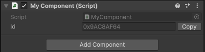
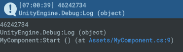

# Persistent Id
<div align="center">
  
  
</div>

Persistent Id is a stable, lightweight editor-time unique ID system for Unity.  
Designed to be dropped into existing projects - "declare and forget" - these identifiers remain **rock-solid** and **dependable** across scene-based workflows:
- Editor Sessions
- Domain Reloads
- Editor Playmode
- and Standalone Builds

## Features
### Guaranteed Unique
- Each generated id is globally unique and internally validated to avoid collisions.
### Non-Monolithic
- Just declare a `PersistentId` field in your MonoBehaviour.
- No "SerializableBehaviour" inheritance, Component reference handling, or refactoring integration costs
### Zero Runtime Cost 
- ID tracking and generation is completely done in the editor.
- Generated IDs are free-standing at runtime with no tracking overhead.
### Prefab-Safe IDs
- Prefab asset files on disk are ignored while editing.
- Only prefab instances in your scenes are tracked.
### Editor Performance-Aware
- No polling editor update loops or sluggish full hierarchy scans while editing
- Full Undo/Redo integration so you don't lose your registered IDs

## Usage
```csharp
using UnityEngine;
using Proselyte.PersistentId;

public class MyComponent : MonoBehaviour
{
    public PersistentId id;
}
```
  
Seriously, that’s it. The editor will handle the unique ID generation.
Then access the identifier as a uint value:
```csharp
public class MyComponent : MonoBehaviour
{
    public PersistentId myId;

	void Start()
	{
		Debug.Log(myId.Id);
	}
}
```


## Why Persistent ID?
If you've tried to work with unique ids in Unity before you've probably run into the issue where `UnityEngine.Object.instanceId` _**won't persist**_ across editor sessions or builds, making it unreliable for long-term object identification.

Existing options for unique identifiers typically rely on **Monolithic** MonoBehaviour inherited classes like "SerializableBehaviour" or "SaveableBehaviour". This inheritance pattern works when starting with it from the ground up, but doesn’t work well if you’re joining a project mid-stream, or decide to pivot to another framework - where integrations and changes require significant refactoring. Think about having to swap the inheritance of all of your scripts from MonoBehaviour to SerializableBehaviour.

Similar packages wrap their ID variable in custom Components that must be manually added to GameObjects, forcing you to pass references around just to access the identifier. This couples your logic to component presence.

PersistentId takes a different approach: it’s lightweight and relies on editor-time generation. Just declare an exposed `PersistentId` field — no inheritance, no extra components, no runtime cost. It responds to scene changes efficiently, without polling or scanning the hierarchy. A **dead simple** fire-and-forget unique ID system that just works.

Persistent Id is optimized for **static scene-based workflows** where objects exist in the editor and need stable identifiers across sessions and builds. It’s brilliant for save systems or analytics—but if your game leans heavily on runtime instantiation, procedural content, or asset-level tracking, you’ll need to extend or supplement it.

## Tradeoffs
| Feature Benefit               | Drawback                                                                      |
|-------------------------------|-------------------------------------------------------------------------------|
| Editor-only Generation        | No runtime generation for dynamic objects                                     |
| Prefab-safe instance tracking | No prefab asset-level IDs                                                     |
| Zero runtime overhead         | No runtime flexibility or dynamic assignment                                  |
| Fire-and-forget simplicity    | No public API for ID registration or generation, fully handled by the editor  |

## FAQ
**Does it work with prefabs?**
You can use persistent ids with prefab _instances_, however as of version v0.1.14 prefab assets (the .prefab file in your project window) do not generate persistent ids.  
Any prefab gameObject instanced in a scene will still generate its own persistent unique id.

**Is it compatible with Unity serialization?**
The id value itself is a uint, and the PersistentId base class has been attributed with `[System.Serializable]`

**Does it work with runtime-instantiated objects?**
Currently no, this persistence system is designed to create persistent IDs that can be generated at editor-time and will never change. This is better suited to objects that are not spawned or instantiated at runtime.
