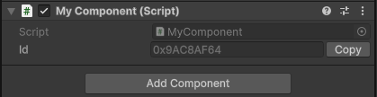

# Persistent Id


Persistent Id is a lightweight editor-generated unique ID system for Unity.  
Designed to be dropped into existing projects with "declare and forget" usage in the editor that remains **rock-solid** and **dependable** across:
- Editor Sessions
- Domain Reloads
- Editor Playmode
- and Standalone Builds

## Features
### Guaranteed Unique
- Each generated id is internally validated to avoid collisions.
### Non-Monolithic
- Just declare a `PersistentId` field in your MonoBehaviour.
- No "SerializableBehaviour" inheritance, Component reference handling, or refactoring integration costs.
### Zero Runtime Cost 
- ID tracking and generation is completely done in the editor.
- Generated IDs are free-standing at runtime with no tracking overhead.
### Prefab-Safe IDs
- Prefab asset files on disk are ignored while editing.
- Only prefab instances in your scenes are tracked.
### Editor Performance-Aware
- No polling editor update loops or sluggish full hierarchy scans

## Usage
```csharp
using UnityEngine;
using Proselyte.PersistentId;

public class MyComponent : MonoBehaviour
{
    public PersistentId id;
}
```
  
Seriously, that’s it.
Then use it like:
```csharp
public class MyComponent : MonoBehaviour
{
    public PersistentId myId;

	void Start()
	{
		Debug.Log(myId.Id);
	}
}
```

## Why Persistent ID?
If you've tried to work with unique ids in Unity before you've probably run into the issue where `UnityEngine.Object.instanceId` _**won't persist**_ across editor sessions or builds, making it unreliable for long-term object identification.

Existing options for unique identifiers typically rely on **Monolithic** MonoBehaviour inherited classes like "SerializableBehaviour" or "SaveableBehaviour". This inheritance pattern works when starting with it from the ground up, but doesn’t work well if you’re joining a project mid-stream, or decide to pivot to another framework - where integrations and changes require significant refactoring. Think about re-inheriting all of your scripts from MonoBehaviour to SerializableBehaviour.

Similar packages wrap their ID variable in custom Components that must be manually added to GameObjects, forcing you to pass references around just to access the identifier. This couples your logic to component presence.

PersistentId takes a different approach: it’s lightweight and relies on editor-time generation. Just declare an exposed `PersistentId` field — no inheritance, no extra components, no runtime cost. It uses Unity’s `ObjectChangeEventStream` to react to scene changes efficiently, without polling or scanning the hierarchy. A **dead simple** fire-and-forget unique ID system that just works.
